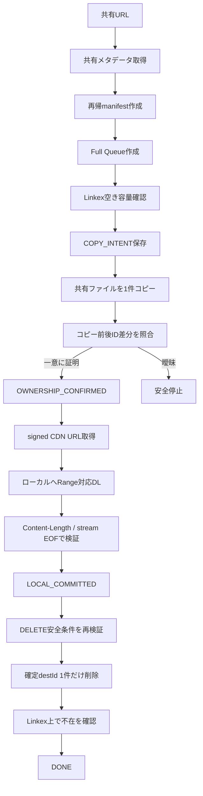
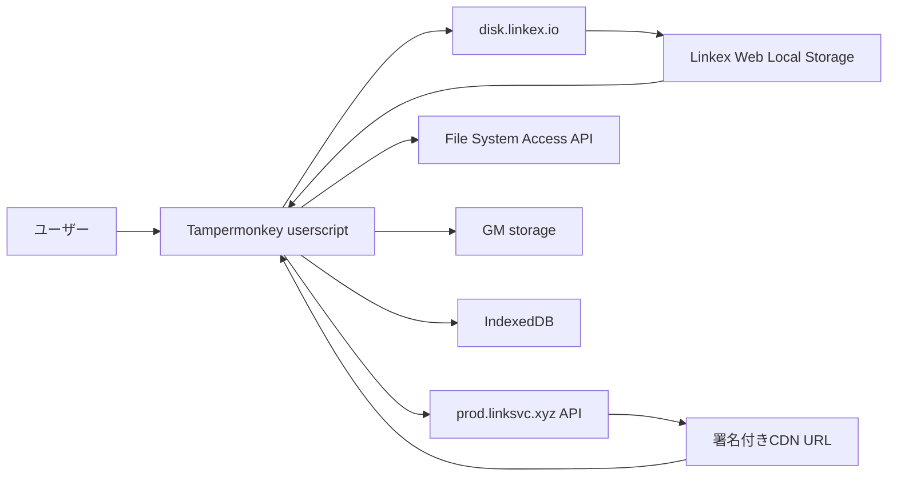
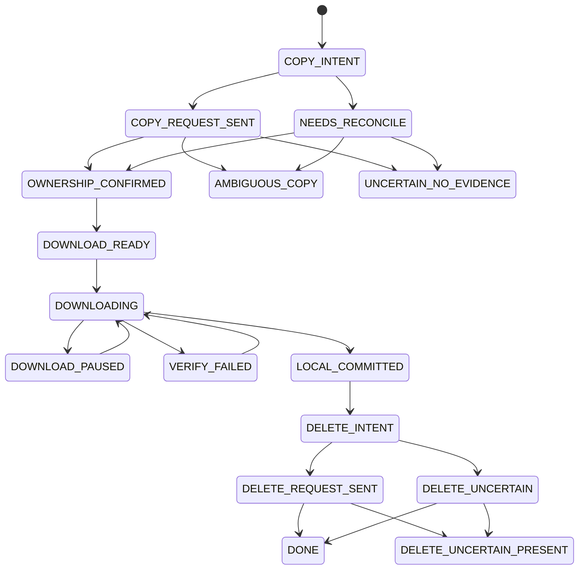

# Linkex Downloader — アーキテクチャ

この文書は、`linkex-downloader.user.js` の全体構造・データフロー・状態遷移を俯瞰するための資料です。

実装上の細かな安全条件、API、既知バグ、開発手順は [`../DEVELOPMENT.md`](../DEVELOPMENT.md) を参照してください。現在動作している実装の正本は `main` の `linkex-downloader.user.js` です。

## 全体像

Linkex Downloader は、`https://disk.linkex.io/*` と `https://l2e.click/d/*`（`www`含む）上で動作する Tampermonkey userscript です。共有ページでは現在URLからshare tokenを自動検出し、自ストレージページでは従来の手入力導線も維持します。

共有リンク内のファイルを直接 CDN から取得するのではなく、各ファイルを一度自分の Linkex ストレージへコピーし、そのコピー先 ID の所有権を確認した後にダウンロードします。ローカル保存を検証できた場合だけ、自分で作成したと証明できる一時コピーを削除します。

## コンポーネント

実装は単一 userscript 内の IIFE にまとまっていますが、責務は概ね次の層に分かれます。

| 層 | 主な責務 | 主な実装 |
|---|---|---|
| 署名・通信 | Linkex API と同じ署名生成、HTTP要求 | `md5()`, `signRequest()`, `LinkexApi` |
| 認証検出/橋渡し | `disk.linkex.io` Local Storageの資格情報候補を検出し、access tokenのみ短時間GM bridgeへ同期 | `discoverCredentials()`, `syncCredentialBridgeFromDisk()`, `resolveCredentials()` |
| Page context | `l2e.click/d/...` の現在share token検出、SPA URL変更時のmanifest guard | `detectSharePageTarget()`, `syncSharePageContext()` |
| 共有解析 | 共有URL解析、フォルダ再帰、manifest生成 | `parseShareToken()`, `buildManifest()` |
| 所有権確定 | コピー前後の root ID 差分から `destId` を確定 | `reconcileCopy()`, `isPlausibleCopy()` |
| ダウンロード | signed URL、Range resume、checkpoint、Content-Length / stream EOF検証 | `downloadOwnedFile()` |
| 削除安全ゲート | `LOCAL_COMMITTED` 後の単一ID削除と結果照合 | `assertDeleteGuards()`, `ensureDeleted()` |
| Queue | 1ファイルずつ直列処理、容量skip、pause/resume | `createQueueFromManifest()`, `processQueue()` |
| 排他 | 別タブとの二重実行防止 | `acquireLease()`, `assertLease()` |
| 永続化 | Queue/transaction/設定/ログ/DirectoryHandle保存 | GM storage, IndexedDB |
| UI/診断 | 右下パネル、進捗、署名テスト、support JSON | `createPanel()`, `downloadSupportBundle()` |

## 外部サービスとの関係

### `disk.linkex.io`

- userscript の実行対象。
- Linkex にログインしたブラウザ状態を利用します。
- Local Storage から Linkex Web の認証情報候補を検出します。
- ファイル/ディレクトリ選択にはページ本体 Window の File System Access API を使用します。

### `l2e.click`

- Share Page Mode の操作起点。
- `/d/<shareToken>` を現在共有として自動検出します。
- 別originのため `disk.linkex.io` Local Storageは直接読めません。認証済みwriteにはuserscript-privateなGM credential bridgeを使います。
- URL変更中でも既存Queueの `job.shareToken` は変更しません。

### Credential bridge

- 保存先: GM storage `linkexCredentialBridgeV1`。
- `disk.linkex.io` で検出したaccess tokenのみ保存し、refresh tokenは保存しません。
- JWT expiryが利用できる場合はそれ以前、利用できない場合も最大12時間で失効させます。
- `l2e.click` 側のLocal Storageにあるtokenらしき値はアカウント認証として信用しません。
- diskページでログアウト状態が確定した場合はbridgeをclearします。

### `prod.linksvc.xyz`

現行実装が利用する Linkex API origin です。読み取り・コピー・削除・タスク状態確認に使用します。

### signed CDN URL

所有権確定済み `destId` の own file metadata から取得します。URLは期限切れになる可能性があるため、403時は Linkex API から取り直します。

## データフロー

### 1. 共有解析

`buildManifest()` は `/share/get/content` を `page_size=100` でページングし、フォルダを再帰します。

manifest に保持する主な情報:

- `sourceId`
- `name`
- `size`
- `remotePath`
- `parentId`
- 共有名
- 合計ファイル数/サイズ

### 2. Queue作成

manifest を基に `createQueueFromManifest()` が Full Queue を作成します。

この時点でローカル相対パスを確定します。Windowsで無効な文字・予約名・長すぎるsegmentをsanitizeし、衝突時は source ID / remote path 由来の hash suffix を付与します。

### 3. Copy transaction

1. Linkexの現在の使用量を確認。
2. own root file ID集合を `beforeIds` として保存。
3. `COPY_INTENT` を永続化。
4. copy POST を **1回だけ**送信。
5. task があれば完了まで確認。
6. own root を再取得し、`beforeIds` との差分を計算。
7. 新規IDが1件で source metadata と整合する場合だけ所有権確定。

新規IDが複数ある場合は、名前などから推測して続行せず `AMBIGUOUS_COPY` として停止します。

### 4. Download transaction

1. 所有権確定済み `destId` から現在の signed URL を取得。
2. 既存ローカルファイルサイズを offset として Range GET。
3. Range が 200 で無視された場合は0 byteから書き直し。
4. 403時はURLを再取得して1回リトライ。
5. 約2 MiBごとにcheckpoint。
6. `Content-Length` が得られる場合は最終ローカルサイズと CDN 実サイズを厳密照合。得られない場合はstreamの正常EOF、stream実書込byte数、最終ローカルサイズの一致を照合。
7. どちらかの検証方式が成立した場合だけ `LOCAL_COMMITTED`。

Linkex metadata の `size` は実CDNサイズと一致しないケースが確認されているため、ローカル完全性判定には使いません。

### 5. Delete transaction

`assertDeleteGuards()` で以下を確認した後だけ DELETE へ進みます。

- transaction が `LOCAL_COMMITTED`
- `confirmedDest.id` が存在
- `destId` がコピー前ID集合に含まれていない
- ダウンロード対象IDと所有権確定IDが一致
- `download.verificationMethod === 'content-length'` の場合は `download.sizeVerified === true` かつ `downloadedBytes === expectedCdnBytes >= 0`
- `download.verificationMethod === 'stream-eof'` の場合は `streamComplete === true` かつstream実書込byte数と最終ローカルサイズが一致
- `verifiedAt` が存在
- 削除直前の name / Linkex metadata size が所有権確定時と一致

DELETE request は常に `select_all:false` + `file_ids:[destId]` の1件です。

応答が不明な場合は再送せず、対象IDが存在するかを照合します。

## 状態遷移

主要な transaction state は次の流れです。

異常・曖昧状態では自動処理継続より停止を優先します。

## Queue状態

Queue全体は主に次を取ります。

- `READY`
- `RUNNING`
- `PAUSED`
- `PAUSED_USER`
- `DONE`
- `DONE_WITH_SKIPS`

item側には `PENDING`, `COPYING`, `COPIED`, `DOWNLOADING`, `LOCAL_COMMITTED`, `DELETING`, `DONE`, `SKIPPED_CAPACITY`, `UNFITTABLE`, `BLOCKED` などがあります。

容量不足/単一ファイル上限のように安全に事前判定できるものはskip可能ですが、所有権・COPY結果・DELETE結果が曖昧な場合はQueueを停止します。

## 永続化

| 保存先 | キー/DB | 用途 |
|---|---|---|
| GM storage | `linkexQueueFullV1` | Full Queue状態 |
| GM storage | `linkexQueueFullLeaseV1` | 多重実行防止lease |
| GM storage | `linkexCopyProbeStateV1` | 現transaction/probe状態 |
| IndexedDB | `linkexDownloaderProbeV1` / `handles` | File System Access API handle |
| GM storage | `linkexDownloaderEventLogV1` | 診断イベント（最大800件） |
| GM storage | `linkexDownloaderUiPrefsV1` | UI折りたたみ状態 |
| GM storage | `lastShareUrl` | 最後に入力/検出した共有URL |
| GM storage | `linkexCredentialBridgeV1` | `disk.linkex.io` から共有ページへ短時間橋渡しするaccess token（refresh tokenは保存しない） |

QueueのDirectoryHandleは `queue-full:<jobId>` を `operationId` として IndexedDB に保存します。

## 排他制御

Queue開始/再開時に lease を取得します。

- lease有効期間: 約30秒
- heartbeat: 約8秒間隔
- 別tab ownerの有効leaseを検出した場合は開始拒否
- 実行中にleaseを失った場合は安全停止

ただし別ブラウザプロファイル・別端末を横断する排他ではありません。そのためQueue実行中に他端末からLinkexへファイル追加/コピーしない運用が必要です。

## 設計上の重要判断

1. **安全性を利便性より優先する。** 曖昧な所有権で削除を続けない。
2. **書き込み結果不明時に同じPOSTを盲目的に再送しない。** 実状態を先に照合する。
3. **Linkex metadata size と CDN実サイズを用途別に分ける。** 前者はidentity、後者はローカル完全性確認。
4. **ローカルパスはQueue作成時に固定する。** 再開時のパス変動を避ける。
5. **File System Access API handleを永続化する。** ページ再読み込み後のresumeを可能にする。
6. **単一ファイル直列処理。** 一時ストレージ消費と所有権判定の複雑化を抑える。

## 変更時に必ず確認する場所

次の領域を変更する場合は [`../DEVELOPMENT.md`](../DEVELOPMENT.md) の安全不変条件と、現行コードを同時に確認してください。

- COPY request / reconciliation
- `beforeIds` / ownership proof
- signed URL / Range処理
- `LOCAL_COMMITTED`
- DELETE guard / reconciliation
- Queue state schema
- lease
- GM storage / IndexedDB migration
- diagnostics redaction

## Quick Download / preferred保存先

新規Queue用のbase directoryは `preferred-download-root:v1` として既存IndexedDB `handles` storeへDirectoryHandleを保存できます。これは新規Queueの利便性専用で、未完了Queueのresume先には使用しません。resumeは常に従来どおり `queue-full:<jobId>` のQueue固有DirectoryHandleを使います。

共有ページの `すべてダウンロード` は、File System Access APIのuser-gesture制約を守るため、保存先permission/pickerを先に確定してから共有manifestのnetwork解析へ進みます。詳細は [`QUICK_DOWNLOAD_UI.md`](QUICK_DOWNLOAD_UI.md) を参照してください。
